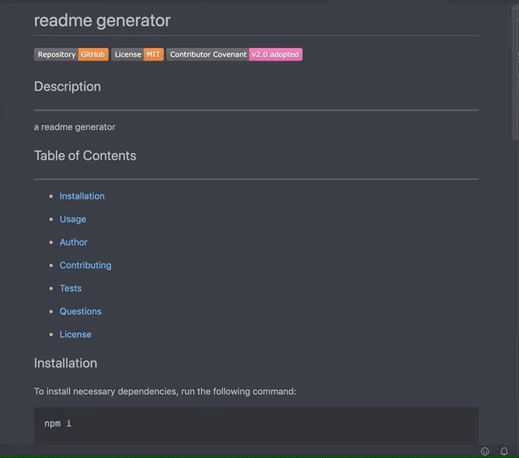

# README Generator
[](https://github.com/gidmp/)

[](code_of_conduct.md) 


## Description
------

README Generator is a tempelate app that is able to take user input through the command line and create a simple md file out of it

## Table of Contents 
------

* [Installation](#installation)

* [Usage](#usage)

* [Author](#author)

* [Tests](#tests)

* [Questions](#questions)

* [License](#license)

## Installation

To install necessary dependencies, run the following command:

```
npm i

```

## Usage 
------

go to file location in terminal and run node index.js




## Author
------

**Daniel Luke Tanoeihusada**

* Github : [@gidmp](https://github.com/gidmp/)

## Tests
------
```
no test were made for this app.

```

## Questions
------


If you have any questions, please contact me, [Daniel Luke Tanoeihusada](danielluke08@gmail.com) directly at danielluke08@gmail.com

## License
------

Copyright 2020 Daniel Luke Tanoeihusada

